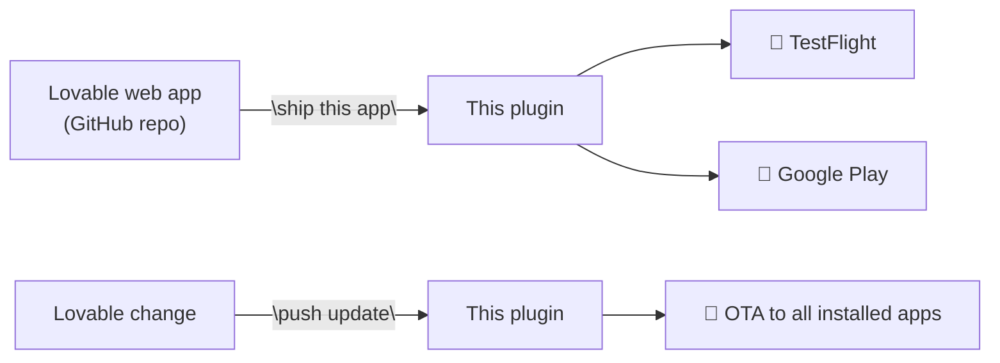
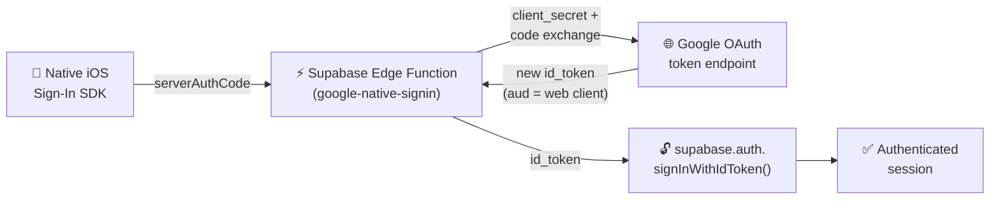

<div align="center">

# Lovable → App Store

**Ship your Lovable web app to the iPhone and Android home screen — by talking to Claude.**

No Xcode. No Android Studio. No app-store paperwork. You describe your app in Lovable, then say *"ship this app"* to Claude. The plugin does the rest — TestFlight in about 30 minutes, Google Play right after.

[](./LICENSE)
[](./CHANGELOG.md)
[](./CHANGELOG.md)
[](https://lovable.dev)

</div>

---

## What this does

You built something amazing in Lovable. Now you want it as a real iOS and Android app — installable from the App Store, with push notifications, in-app purchases, native Google / Apple Sign-In.

Doing that yourself means: weeks of Capacitor configuration, Apple Developer Portal navigation, Google Play Console paperwork, certificates, signing keys, edge functions for OAuth on Lovable-managed Supabase, CI workflows, Info.plist surgery, ITMS rejection emails…

Or you install this plugin and say *"ship this app to TestFlight"*. That's the actual workflow.



---

## ✨ What you get

| | |
|---|---|
| 📦 **Three skills** | `ship` (first time), `update` (OTA after edits), `add-native` (camera, Face ID, etc.) |
| ⚡ **First ship: ~30 minutes** | From Lovable URL to TestFlight invite, including Apple Developer + Google Play registration |
| 🔄 **OTA updates: instant** | Push Lovable changes to installed apps without an app-store re-submission |
| 🔐 **Native Google + Apple Sign-In** | The Supabase Edge Function trick that makes native sign-in actually work on Lovable-managed Supabase |
| 🛡️ **Battle-tested** | Real April-2026 gotchas baked in: ITMS-91061, iOS 26 SDK deadline, provisioning-profile invalidation, /tmp clearing |
| 🧠 **Persistent memory** | Remembers your Apple Team ID, RevenueCat keys, OneSignal IDs across runs — never asks twice |

---

## 🚀 Quick Start (60 seconds)

**Step 1 — Install the plugin.** Pick the path for whichever Claude product you use:

<details open>
<summary><b>📱 If you use Cowork (the desktop chat app — most Lovable users)</b></summary>

1. Download the latest plugin file: **[lovable-to-app-store.plugin](https://github.com/Mark-Taikai/lovable-to-app-store/releases/latest/download/lovable-to-app-store.plugin)** (one file, ~80 KB)
2. Open Cowork → Settings → Plugins → click **"Add plugin"** (or the equivalent in your Cowork version)
3. Drag the `.plugin` file onto the install dialog — done.

> Cowork doesn't support adding GitHub marketplaces directly from chat, so the drag-drop is the supported path. Future Cowork versions may change this.

</details>

<details>
<summary><b>💻 If you use Claude Code (the terminal CLI)</b></summary>

In your terminal, with Claude Code running, paste:

```
/plugin marketplace add Mark-Taikai/lovable-to-app-store
/plugin install lovable-to-app-store@lovable-to-app-store
```

To update later when a new version ships:

```
/plugin update lovable-to-app-store@lovable-to-app-store
```

</details>

**Step 2 — Have these accounts ready** (the plugin will walk you through each):

- ✅ Apple Developer Program — $99/yr — [enroll here](https://developer.apple.com/programs/)
- ✅ Google Play Console — $25 one-time — [sign up here](https://play.google.com/console/signup)
- ✅ A Lovable app with a public GitHub repo

**Step 3 — Talk to Claude:**

> *"Ship this app to TestFlight: https://github.com/your/lovable-app"*

Claude will ask ~6 plain-English questions, register everything, and submit your build. About 30 minutes later you'll have a TestFlight link to tap.

📖 **More detail:** [Getting Started Guide](./docs/getting-started.md)

---

## 🎯 Designed for Lovable users — not engineers

If you've never seen Xcode, that's fine. The plugin handles:

- 🔑 Apple Developer Portal browsing (registers App IDs, generates the API key)
- 🔑 App Store Connect listing (creates the app, fills out metadata)
- 🔑 Google Play Console (uploads your AAB, sets up internal testing)
- 🔑 RevenueCat (in-app purchases — free up to $2.5k MTR)
- 🔑 OneSignal (push notifications — free up to 10k subscribers)
- 🔑 Capgo (OTA updates — free tier available)
- 🔑 Capacitor configuration (the bridge between web → native)
- 🔑 GitHub Actions CI (so you don't need a Mac for builds)
- 🔑 Info.plist surgery (compliance keys, encryption declarations, OAuth schemes)
- 🔑 Certificate + provisioning profile dance (this is the hard part — the plugin does it)
- 🔑 Supabase Edge Functions for native Google / Apple Sign-In

**You only need to:**
1. Click "approve" on a few browser dialogs.
2. Provide passwords for accounts you create along the way.
3. Wait for builds to finish.

---

## 🔐 Native Google & Apple Sign-In on Lovable + Supabase

This is the part most tutorials get wrong. On Lovable-managed Supabase, the native iOS sign-in token has the wrong `aud` claim — Supabase rejects it, and the sign-in drawer either won't close or returns an unauthenticated session.

**The fix this plugin handles automatically:**



When you say *"ship this app and it uses Google Sign-In"*, the plugin creates the edge function, configures the three OAuth clients (Web + iOS + Android), wires up the `capacitor.config.ts` and `Info.plist`, and reminds you to ask Lovable to deploy the function. Same flow for Apple Sign-In.

📖 **Deep dive:** [`plugins/lovable-to-app-store/skills/ship/references/07-google-native-signin.md`](./plugins/lovable-to-app-store/skills/ship/references/07-google-native-signin.md)

---

## 📚 Documentation

| Doc | When you need it |
|---|---|
| [Getting Started](./docs/getting-started.md) | First time using the plugin — start here |
| [Installation](./docs/installation.md) | Detailed install for Claude Code and Cowork |
| [Troubleshooting](./docs/troubleshooting.md) | When something breaks |
| [FAQ](./docs/faq.md) | Common questions before you commit |
| [Plugin reference](./plugins/lovable-to-app-store/README.md) | Full skill + workflow reference |
| [Changelog](./CHANGELOG.md) | What changed between versions |

---

## 🛠️ What's in this repo

```
.
├── .claude-plugin/
│   └── marketplace.json          ← plugin marketplace manifest
├── plugins/
│   └── lovable-to-app-store/     ← the plugin itself
│       ├── README.md             ← detailed plugin docs
│       └── skills/
│           ├── ship/             ← end-to-end submission
│           ├── add-native/       ← add native Capacitor features
│           └── update/           ← OTA updates via Capgo
├── docs/                         ← user guides
│   ├── getting-started.md
│   ├── installation.md
│   ├── troubleshooting.md
│   └── faq.md
├── .github/                      ← issue + PR templates
├── CHANGELOG.md
├── CONTRIBUTING.md
├── CODE_OF_CONDUCT.md
├── SECURITY.md
├── LICENSE                       ← MIT
└── README.md                     ← this file
```

---

## 💬 Community

- 🐛 **Found a bug?** [Open an issue](https://github.com/Mark-Taikai/lovable-to-app-store/issues/new?template=bug_report.md)
- 💡 **Have a feature request?** [Suggest one](https://github.com/Mark-Taikai/lovable-to-app-store/issues/new?template=feature_request.md)
- ❓ **Have a question?** [Ask here](https://github.com/Mark-Taikai/lovable-to-app-store/issues/new?template=question.md)
- 🔒 **Security disclosure?** See [SECURITY.md](./SECURITY.md)
- 🤝 **Want to contribute?** See [CONTRIBUTING.md](./CONTRIBUTING.md)

---

## 📜 License

MIT — see [LICENSE](./LICENSE). Use it, fork it, adapt it. If you ship something cool, [tell us about it](https://github.com/Mark-Taikai/lovable-to-app-store/discussions).

---

<div align="center">

**Made for the Lovable community.** &nbsp;•&nbsp; Built with [Anthropic's Claude](https://claude.com).

</div>
