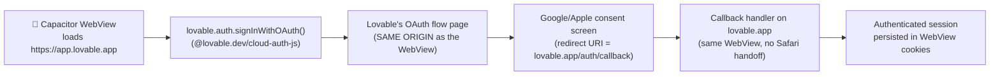

# 14 — Lovable Cloud Auth (`@lovable.dev/cloud-auth-js`) Native Sign-In

> Use this reference when the app has `@lovable.dev/cloud-auth-js` in its dependencies. This is **Path B** from the two-path rule in `ship/SKILL.md`. For apps using raw `@supabase/supabase-js`, use refs 07 and 08 instead.

This is the canonical native-sign-in flow for **TanStack Start + Cloudflare Workers** Lovable apps where the auth client is `@lovable.dev/cloud-auth-js`. The key difference from refs 07 + 08: Lovable Cloud Auth handles the WebView OAuth redirect internally, so the edge-function code-exchange dance isn't strictly necessary — `signInWithOAuth()` works inside a Capacitor WebView when wrapped correctly.

---

## Detection

In Step 1, the architecture detector flags this path when:
- `@lovable.dev/cloud-auth-js` is in `package.json` dependencies, AND
- `capacitor.config.ts` uses `server.url` pointing at the Lovable production URL

Save to memory under `architecture: "tanstack-cloudflare"` and `auth_client: "lovable-cloud"`.

---

## How it works (architecture)



The trick: because the WebView's origin **is** `lovable.app` (via `server.url`), the OAuth redirect URI registered with Google/Apple (also `lovable.app/auth/callback`) lands in the **same WebView** — not Safari. The session cookies stay where the app can use them.

This is the OPPOSITE of the failure mode that broke raw Supabase OAuth in v1.x: there, the WebView's origin was a Capacitor `capacitor://localhost` URL, the redirect URI was the Lovable domain, and the browser couldn't keep the auth flow inside the WebView. With `server.url` + Lovable Cloud Auth, the WebView and the redirect URI share origin, so it Just Works.

---

## Step 1: Verify `server.url` is set correctly in `capacitor.config.ts`

```typescript
import { CapacitorConfig } from '@capacitor/cli';

const config: CapacitorConfig = {
  appId: '{{BUNDLE_ID}}',
  appName: '{{APP_DISPLAY_NAME}}',
  webDir: 'dist',  // Local fallback if server is unreachable
  server: {
    url: '{{LOVABLE_URL}}',   // e.g. https://design-tabletop-ai.lovable.app
    cleartext: false,
    androidScheme: 'https',
  },
  // ... rest of plugins config from capacitor.config.ts template
};

export default config;
```

The `server.url` MUST match the redirect URI you registered with Google Cloud Console and Apple Developer Portal Services ID. If they diverge by even a trailing slash, OAuth lands outside the WebView.

---

## Step 2: Wire `lovable.auth.signInWithOAuth()` for Google

Create `src/integrations/lovable/native-auth.ts`:

```typescript
import { lovable } from '@/integrations/lovable/client';
import { Capacitor } from '@capacitor/core';

export const nativeGoogleSignIn = async (): Promise<{ success: boolean; error?: string }> => {
  try {
    const { data, error } = await lovable.auth.signInWithOAuth({
      provider: 'google',
      options: {
        // CRITICAL: this URL MUST equal the WebView's current origin.
        // Inside a Capacitor WebView with server.url set, that's the Lovable URL.
        redirectTo: window.location.origin + '/auth/callback',
      },
    });

    if (error) {
      console.error('[LovableCloudAuth Google] signInWithOAuth error:', error);
      return { success: false, error: error.message };
    }

    // Lovable Cloud Auth opens its hosted OAuth flow in the SAME WebView.
    // No Safari handoff. The callback returns to /auth/callback inside the
    // WebView and the session is persisted to localStorage on lovable.app.
    return { success: true };
  } catch (e: any) {
    return { success: false, error: e?.message || 'Google Sign-In failed' };
  }
};

export const nativeAppleSignIn = async (): Promise<{ success: boolean; error?: string }> => {
  try {
    const { error } = await lovable.auth.signInWithOAuth({
      provider: 'apple',
      options: {
        redirectTo: window.location.origin + '/auth/callback',
      },
    });
    if (error) return { success: false, error: error.message };
    return { success: true };
  } catch (e: any) {
    return { success: false, error: e?.message || 'Apple Sign-In failed' };
  }
};
```

Then in your sign-in component (typically `src/routes/sign-in.tsx`), call these wrappers instead of `lovable.auth.signInWithOAuth()` directly:

```typescript
import { nativeGoogleSignIn } from '@/integrations/lovable/native-auth';
import { Capacitor } from '@capacitor/core';

const handleGoogleSignIn = async () => {
  if (Capacitor.isNativePlatform()) {
    const result = await nativeGoogleSignIn();
    if (!result.success) showError(result.error);
    // Auth state change listener handles the navigation
    return;
  }

  // Web fallback (browser environment)
  await lovable.auth.signInWithOAuth({ provider: 'google' });
};
```

**Why a wrapper?** It lets you keep the native vs web branching explicit. If Lovable Cloud Auth changes its options shape in the future, you fix it in one file instead of every component that calls sign-in.

---

## Step 3: Configure OAuth providers in Lovable Cloud

In the Lovable project settings (NOT the Supabase dashboard — Lovable Cloud has its own auth config):

1. **Lovable project → Cloud → Auth → Providers → Google**:
   - Enable Google provider
   - Client ID = your Google Cloud Console **Web** OAuth client ID
   - Client Secret = the Web Client Secret
   - Authorized redirect URI: `https://{your-app}.lovable.app/auth/callback`

2. **Lovable project → Cloud → Auth → Providers → Apple**:
   - Enable Apple provider
   - Services ID = `com.{your-org}.{your-app}.signinwithapple`
   - Team ID = your Apple Team ID
   - Key ID + Key file = the Sign in with Apple `.p8`
   - Authorized redirect URI: `https://{your-app}.lovable.app/auth/callback`

3. In Google Cloud Console → OAuth client (Web type) → Authorized redirect URIs, add:
   - `https://{your-app}.lovable.app/auth/callback`

4. In Apple Developer Portal → Identifiers → Services IDs → your Services ID → Web Authentication Configuration:
   - Domains: `{your-app}.lovable.app`
   - Return URLs: `https://{your-app}.lovable.app/auth/callback`

---

## Step 4: Info.plist additions for native sign-in (still needed)

Even though the OAuth flow stays inside the WebView via `server.url`, the native iOS Google Sign-In SDK still needs the URL scheme entry (in case the user later wants to swap to native SDK flow):

```xml
<!-- Only needed if you ALSO bundle @codetrix-studio/capacitor-google-auth for native SDK fallback -->
<key>CFBundleURLTypes</key>
<array>
  <dict>
    <key>CFBundleURLSchemes</key>
    <array>
      <string>{google_ios_reversed_client_id}</string>
    </array>
  </dict>
</array>
```

For Apple Sign-In via Lovable Cloud Auth, the App.entitlements + Services ID configuration in Step 3 is sufficient — no Info.plist entry needed beyond what's already in `info-plist-additions.xml`.

---

## Step 5: Apple Guideline 4.2 mitigation (because we're using `server.url`)

A `server.url`-based binary is technically a WebView wrapper. Apple's reviewers sometimes flag this under Guideline 4.2 ("Minimum Functionality"). To pass review, the app should demonstrate substantial native value:

**Add at minimum 2 of these native integrations** (the plugin's `add-native` skill installs each):

- `@capacitor/haptics` — vibration feedback on button presses
- `@onesignal/onesignal-capacitor` — native push notifications
- `@revenuecat/purchases-capacitor` — in-app purchases / subscriptions
- `@capacitor/share` — native iOS share sheet
- `@capacitor-community/biometric-auth` — Face ID / Touch ID on top of the existing web login
- `@capacitor/camera` — if the app has any feature that could plausibly use photos

In the App Store Connect submission notes, mention: *"Native integrations: haptic feedback throughout, push notifications via OneSignal, biometric authentication via Face ID. App is a native shell with these capabilities, not a webview wrapper."*

This is what passes Apple 4.2 review for `server.url` apps. The combination of substantial native features + Lovable Cloud Auth's working OAuth is the path that ships TanStack Lovable apps successfully.

---

## Common failures specific to Path B

| Symptom | Cause | Fix |
|---|---|---|
| Sign-in works on web but does nothing on iOS | `redirectTo` doesn't match the WebView's origin | Use `window.location.origin + '/auth/callback'` — never hardcode |
| Sign-in opens Safari and authenticates there, app stays logged out | `server.url` not set, OR redirect URI doesn't match the WebView origin | Add `server.url` to `capacitor.config.ts`, verify redirect URIs in Google/Apple/Lovable Cloud all use the same Lovable subdomain |
| Apple Sign-In returns `invalid_client` | Services ID's primary App ID doesn't match the bundle ID | Reconfigure in Apple Developer Portal → Identifiers → your Services ID |
| App rejected under Apple Guideline 4.2 | App is too thin — pure WebView shell | Add native features per Step 5, resubmit with submission notes mentioning the native integrations |
| OAuth callback loops forever | `/auth/callback` route in TanStack doesn't exist OR has client-side guard that redirects unauthenticated users back to /sign-in | Verify the route handles the callback params (`code`, `state`) and calls `lovable.auth.exchangeCodeForSession` |

---

## Memory schema additions for Lovable Cloud Auth apps

In the app's memory file:

```json
{
  "...": "...",
  "architecture": "tanstack-cloudflare",
  "auth_client": "lovable-cloud",
  "lovable_cloud_auth": {
    "google_web_client_id": "NUMERIC.apps.googleusercontent.com",
    "google_web_client_secret": "GOCSPX-...",
    "apple_services_id": "com.yourorg.yourapp.signinwithapple",
    "apple_team_id": "ABCDE12345",
    "apple_signin_key_id": "G35C9M979Q",
    "apple_signin_key_path": "~/Documents/Claude/lovable-to-app-store/keys/AuthKey_G35C9M979Q.p8",
    "lovable_callback_url": "https://your-app.lovable.app/auth/callback",
    "native_path": "server.url + Lovable Cloud Auth signInWithOAuth()",
    "_note": "No edge function needed for this app — Lovable Cloud Auth handles WebView OAuth via same-origin redirect."
  }
}
```

This lets future `update` runs verify the auth setup is intact without re-walking the Google/Apple console.
